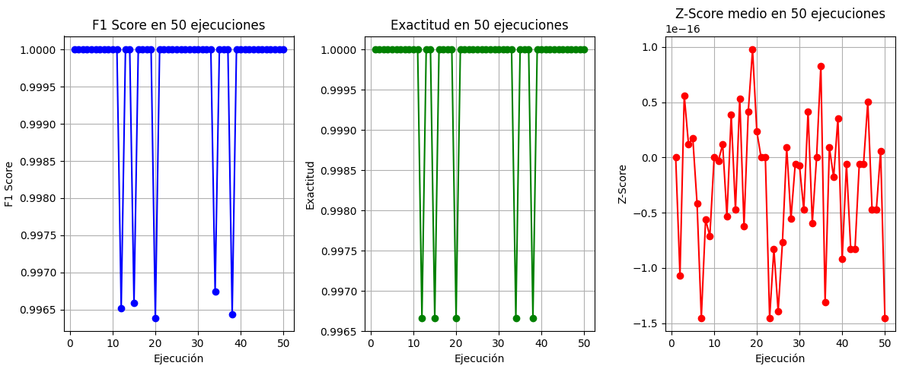

# Clasificación de Correos SPAM vs HAM con Árbol de Decisión
### Machine Learning 802
## Autores
- Gabriela Alvarez Martinez  
- Ivan Yesid Camargo Bocachica  

---

## Objetivo
El propósito de este trabajo es diseñar y evaluar un modelo de Machine Learning capaz de identificar si un correo electrónico corresponde a la categoría **SPAM** (*correo basura*) o **HAM** (*correo legítimo*).  
Para ello se implementó un árbol de decisión como clasificador principal, analizando su comportamiento a través de métricas de desempeño y observando cómo varían los resultados al ejecutar el modelo repetidas veces.

Con esto se busca no solo validar la efectividad del árbol de decisión, sino también entender su estabilidad y consistencia cuando los datos de entrenamiento y prueba cambian en cada ejecución.

---

## Dataset
El dataset utilizado contiene **1000** instancias de correos electrónicos, cada uno descrito por un conjunto de características (*features*).  
De las **10** variables originales, se seleccionaron aquellas que podían ser representadas numéricamente:

- `longitud_cuerpo`: número de caracteres en el cuerpo del correo.  
- `num_adjuntos`: cantidad de archivos adjuntos.  
- `num_links`: enlaces incluidos en el mensaje.  
- `remitente_empresa`: indicador si el remitente pertenece a una empresa.  
- `contiene_palabras_dinero`: si aparecen términos relacionados con dinero o premios.  
- `urgencia`: refleja si el correo transmite sensación de urgencia.  

Algunas variables, como el nombre del remitente, no fueron incluidas ya que presentan una alta variabilidad y complejidad para ser cuantificadas. Esto se decidió para evitar introducir ruido o distorsiones en el modelo.

---

## Metodología
1. **División de datos =** El conjunto fue separado en **70%** para entrenamiento y **30%** para prueba, con particiones diferentes en cada ejecución.  
2. **Clasificador =** Se empleó un único árbol de decisión (no ensembles como Random Forest), con el fin de evaluar su comportamiento de manera aislada.  
3. **Repeticiones =** El proceso se repitió **50 veces** para observar la variación de resultados y determinar si el modelo mejora, empeora o mantiene estabilidad.  
4. **Métricas utilizadas**:  
   - **F1 Score**: mide el balance entre precisión y recall, clave en problemas de clasificación desbalanceada.  
   - **Exactitud (Accuracy)**: porcentaje de correos correctamente clasificados.  
   - **Z-Score**: mide la dispersión estadística de las predicciones, indicando qué tan alejados están de la media.  
5. **Visualización =** Los resultados de cada ejecución se graficaron para identificar tendencias y patrones de desempeño.

---

## Resultados

1. **F1 Score promedio**: 
La métrica F1, que combina precisión y exhaustividad, se mantuvo en un valor cercano a 1 en la mayoría de las ejecuciones. Esto indica que el árbol de decisión logró clasificar correctamente casi todos los correos.
Sin embargo, en unas pocas iteraciones se observó una ligera caída, lo que refleja que la estabilidad del modelo depende de cómo se dividan los datos entre entrenamiento y prueba. 
2. **Exactitud promedio**:
Al igual que el F1 Score, la exactitud se mantuvo cercana al 100% en casi todos los intentos, confirmando que el modelo puede identificar correctamente si un correo es SPAM o HAM.
Aun así, algunas ejecuciones tuvieron un desempeño ligeramente menor, evidenciando que no siempre se logra una clasificación perfecta.
3. **Z-Score promedio**:  
Esta métrica muestra qué tan alejados están los resultados respecto al promedio. En las gráficas se observa que la mayoría de los valores se concentran alrededor de cero, lo que implica que el modelo es consistente en sus predicciones.
Los puntos que se alejan más indican ejecuciones atípicas, pero al ser pocos no afectan la conclusión general de la estabilidad del árbol.

### Gráficas obtenidas
El análisis de estas gráficas permite ver si el árbol de decisión mantiene un comportamiento consistente o si presenta variaciones significativas dependiendo de los datos usados en cada corrida.

---

## Conclusiones
- El árbol de decisión, aún siendo un modelo simple y sin ajustes de hiperparámetros, logra un rendimiento muy alto en este dataset de correos.

- Después de 50 ejecuciones, se evidencia que el modelo mantiene una precisión casi perfecta en la mayoría de los casos, lo que confirma su capacidad de generalización.

- La presencia de algunas caídas en las métricas muestra que no todas las divisiones de los datos permiten el mismo desempeño, pero estas diferencias son mínimas.

- El Z-Score cercano a cero respalda la idea de que los resultados son estables y consistentes en general.
---

## Limitaciones y mejoras futuras
- Al ser un único árbol de decisión, el modelo puede ser sensible al sobreajuste (*overfitting*), lo que limita su capacidad de generalización.  
- Algunas características textuales no fueron incluidas porque no se transformaron en valores numéricos. Incluir técnicas de procesamiento de lenguaje natural (NLP) podría enriquecer el modelo.  
- Sería recomendable comparar este árbol con otros algoritmos más sofisticados como Random Forest, Support Vector Machines o incluso Redes Neuronales, para evaluar si se logran mejoras significativas.  

---
